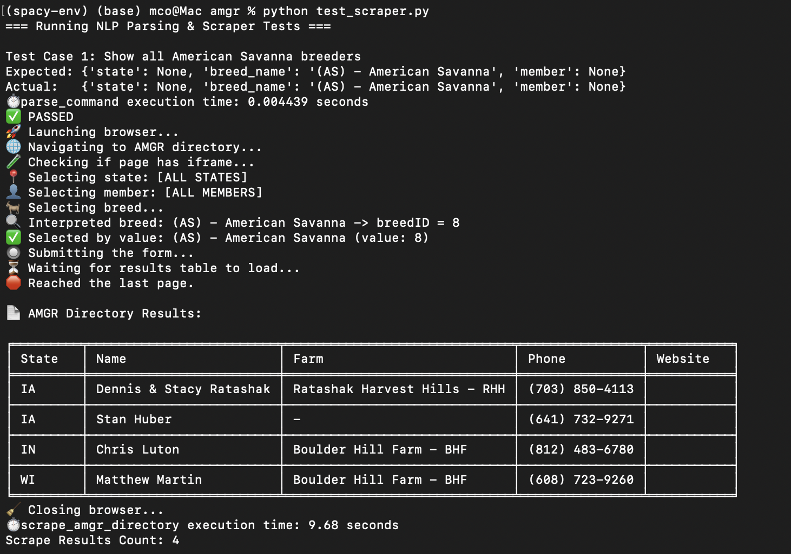
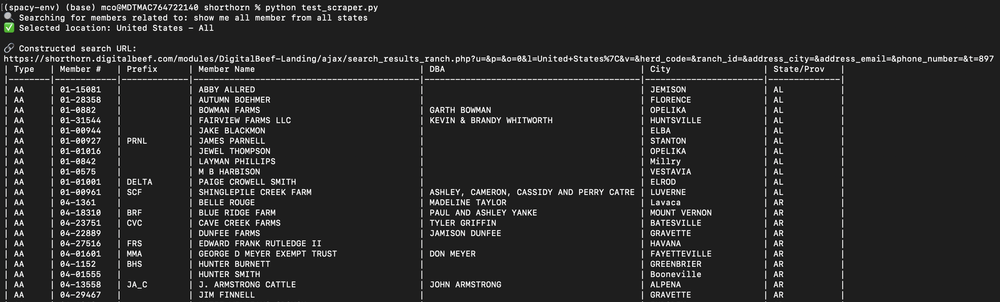

# 🧠 NLP-Scraping Project

This repository contains two natural language-powered web scrapers using **spaCy** and **Selenium**:

- 🐐 `amgr/`: Scraper for [American Meat Goat Registry (AMGR)](https://www.amgr.org/frm_directorySearch.cfm)
- 🐂 `shorthorn/`: Scraper for [Shorthorn DigitalBeef](https://shorthorn.digitalbeef.com/)


## 🗂 Folder Structure

nlp-scraping/
├── amgr/
│ ├── amgr_nlp_scraper.py
│ ├── test_scraper.py
│ └── spacy-env/
│
├── shorthorn/
│ ├── shorthorn_nlp_scraper.py
│ ├── test_scraper.py
│ └── spacy-env/
│
├── venv/
├── README.md
└── requirements.txt

---

## 🚀 Quick Start

1. **Install dependencies:**

```bash
pip install -r requirements.txt
python -m spacy download en_core_web_sm


--amgr--
# Activate spaCy environment
source amgr/spacy-env/bin/activate

# Run the main scraper
python amgr/amgr_nlp_scraper.py

# Run the test script
python amgr/test_scraper.py




--shorthorn--
# Activate spaCy environment
source shorthorn/spacy-env/bin/activate

# Run the main scraper
python shorthorn/shorthorn_nlp_scraper.py

# Run the test script
python shorthorn/test_scraper.py

